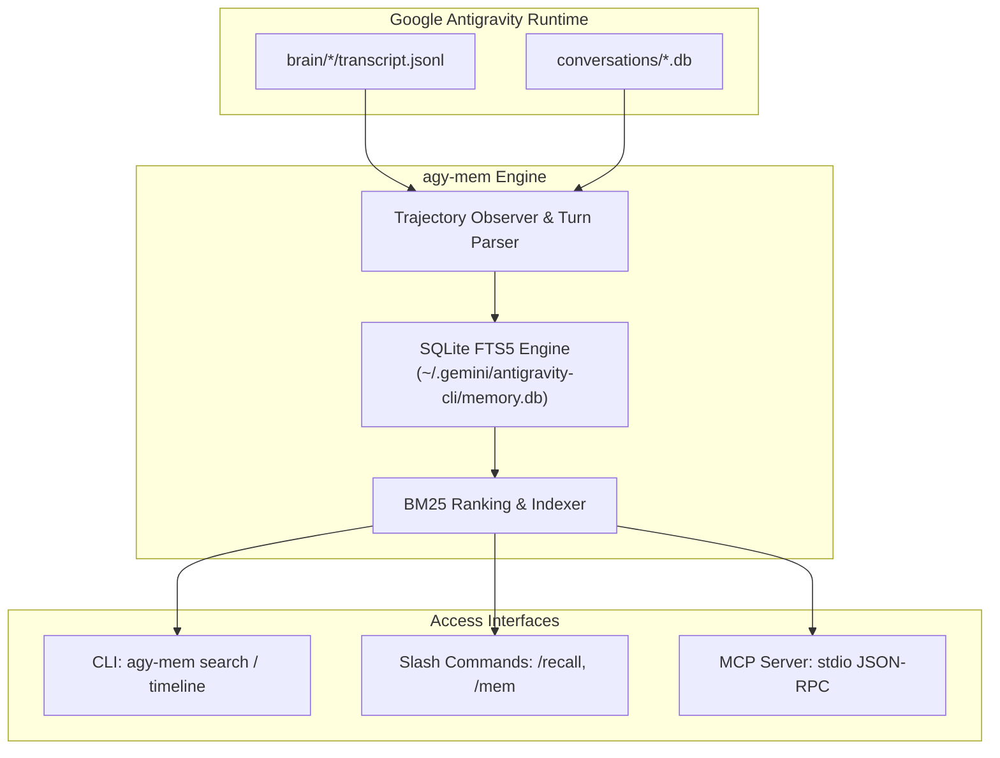

<div align="center">

# 🧠 agy-mem

**Autonomous Background Memory, Observation Extractor & Fast Recall Engine for Google Antigravity (`agy`)**

*Persistent cross-session intelligence and sub-millisecond retrieval with **zero external dependencies**.*

[](https://pypi.org/project/agy-mem/)
[](https://pypistats.org/packages/agy-mem)
[](LICENSE)
[](https://www.python.org/)
[-success.svg)]()
[](https://modelcontextprotocol.io/)

</div>

---

## ⚡ The Problem & The Solution

When working with AI coding agents like **Google Antigravity (`agy`)**, starting a new session often means starting with amnesia. You find yourself repeatedly explaining project architectures, database schemas, prior bugfixes, and coding preferences.

Tools like `claude-mem` and `antigravity-memory` attempt to solve this, but require heavy Node.js runtimes, hundreds of megabytes of `node_modules`, and external API keys to pay for AI summarizations.

**`agy-mem` solves this natively:**
1. **0 Dependencies:** Pure Python 3 standard library with native **SQLite FTS5**, column-weighted **BM25 ranking** (`title: 10x`, `concepts: 5x`, `facts: 3x`), and automatic prefix fuzzy matching (`term*`).
2. **Stale-Aware Real-Time Auto-Sync:** Zero-touch autonomous indexing. Checks Antigravity transcript timestamps before queries and automatically indexes new turns in $< 15\text{ms}$.
3. **Auto-Project Scoping:** Automatically senses your active CWD or Git repository to prioritize and scope memories without manual flags, with automatic global fallback.
4. **File Decision Lineage:** Lookup all architectural decisions, bugfixes, and code changes that touched a specific file (`agy-mem file <path>`).
5. **Portable Exporter:** Export structured Markdown briefings or JSON archives for onboarding and team sharing (`agy-mem export`).
6. **Official MCP Server:** Speaks standard Model Context Protocol (JSON-RPC 2.0 stdio), exposing `search`, `recall`, `file_history`, `get_observations`, `timeline`, and `sync`.
7. **Sub-50ms Latency:** Instant terminal search and prompt recall.

---

## 📊 Comparison

| Feature | `antigravity-memory` (npm) | `claude-mem` | **`agy-mem` (This Project)** |
| :--- | :--- | :--- | :--- |
| **Language** | Node.js / TypeScript | Node.js / Webpack | **Pure Python 3** |
| **External Dependencies** | Heavy (`npm`, `better-sqlite3`) | Heavy (`npm`, ChromaDB) | **0 (Python Standard Library)** |
| **Install Footprint** | ~100 MB+ | ~120 MB+ | **~38 KB (Single file)** |
| **Data Ingestion** | Manual tool calls | Claude hook / daemon | **Real-Time Auto-Syncing Observer** |
| **API Cost / Quota** | Calls Gemini API for summaries | Calls Claude API | **$0 / Zero token cost** |
| **Search Engine** | Basic SQL | Vector embeddings | **Weighted SQLite FTS5 (BM25)** |
| **Prefix Autocomplete** | No | No | **Yes (`term*` expansion)** |
| **Auto-Project Scoping** | No | No | **Yes (CWD & Git root detection)** |
| **File Lineage History** | No | No | **Yes (`agy-mem file <path>`)** |
| **Markdown / JSON Export** | No | No | **Yes (`agy-mem export`)** |
| **MCP Compliance** | Yes | Yes | **Yes (JSON-RPC 2.0 stdio)** |
| **Historical Backfill** | Future sessions only | Future sessions only | **Instant full-history backfill** |

---

## 🚀 Installation

### Option 1: Via pip (Standard Python Package)
```bash
pip install agy-mem
agy-mem init
```
*(Running `agy-mem init` registers the MCP server in `~/.gemini/config/mcp_config.json`, generates schemas, and configures `/recall` and `/mem` slash commands).*

### Option 2: 1-Line Automated Setup (Includes MCP & Antigravity Skills)
Install `agy-mem`, register the MCP server, and add the `/recall` & `/mem` slash commands in a single command:

```bash
curl -sSL https://raw.githubusercontent.com/Cancelllls/agy-mem/main/install.sh | bash
```

### Option 3: Clone & Install Manually

```bash
git clone https://github.com/Cancelllls/agy-mem.git
cd agy-mem
chmod +x install.sh
./install.sh
```

---

## 💡 How to Use

### 1. In Any Terminal

```bash
# Search memories (auto-scoped to current repo, or global with -a)
agy-mem search "statusl"               # Prefix match e.g. statusline
agy-mem search "offline prayer"        # Auto-scoped to current project (e.g. Aya)
agy-mem search "offline prayer" -a     # -a / --all searches across all projects
agy-mem search "timeout" -v            # -v / --verbose shows full diff facts & commands

# Inspect file history & decision lineage
agy-mem file offline_prayer_service.dart
agy-mem file SilenceDetector.kt -v

# Export project memory summary for documentation or team sharing
agy-mem export -p Aya -o AYA_MEMORY.md
agy-mem export -p Badil --format json

# Recall context formatted for prompt injection
agy-mem recall "offline barcode scanner"

# View chronological timeline (auto-scoped to current repo, or global with -a)
agy-mem timeline --limit 5
agy-mem timeline -a --limit 5
agy-mem timeline --earliest --limit 3

# Check database health & breakdown by project
agy-mem status

# Manually store a technical observation
agy-mem add --project Aya --type architecture --title "WAL Mode SQLite" --narrative "Enabled WAL mode and memory pragmas."

# Trigger full manual sync (auto-sync already runs in background)
agy-mem sync
```

### 2. Inside Google Antigravity (`agy` prompt)

`agy-mem` installs native slash commands in `~/.agent/skills/`:

* **/recall `<topic>`**: Injects past decisions, bugfixes, and code files directly into your active prompt context.
* **/mem**: Displays the live memory dashboard, synced session counts, and database health.

### 3. As an MCP Server (Model Context Protocol)

`agy-mem` automatically registers itself in `~/.gemini/config/mcp_config.json`:

```json
{
  "mcpServers": {
    "agy-mem": {
      "command": "/home/ubuntu/.local/bin/agy-mem",
      "args": ["mcp"]
    }
  }
}
```

Any MCP-compatible AI agent can now call:
* `search`: Full-text memory search with BM25 scoring.
* `file_history`: Decision and patch history for a specific file.
* `get_observations`: Fetch complete details and diffs for observation IDs.
* `recall`: Markdown context block formatted for immediate reasoning.
* `timeline`: Chronological event sequence.
* `add_observation`: Store new decisions programmatically.
* `sync`: Trigger background observation extraction.

---

## 🏗️ Architecture



---

## 📄 License

MIT License © 2026 Abdalrahman Samir / Cancellls. See [LICENSE](LICENSE) for details.
